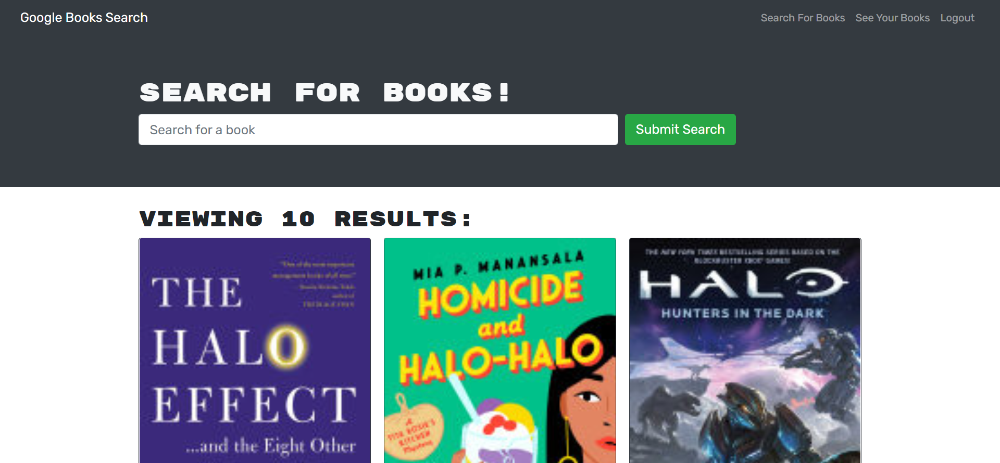

# Module 21 challenge: Book Search Engine

## Description

This Module 21 Challenge repository was created to complete the Module 21 Challenge of the bootcamp.

This project aims to take a fully functioning Google Books API search engine built with a RESTful API, and refactor it to be a GraphQL API built with Apollo Server.
The app was built using the MERN stack, with a React front end, MongoDB database, and Node.js/Express.js server and API.

## Installation

Please make sure to run the command "npm install" to install all required node modules before running the program. 
Please also make sure to run the command "npm run build" to build all client-side modules. 

## Usage

Please run the command "npm run develop" in terminal to start the local server.

Link to deployed application: https://wongpakho814.github.io/module-20-challenge-React-Portfolio/#portfolio

## Credits

N/A

## License

N/A
